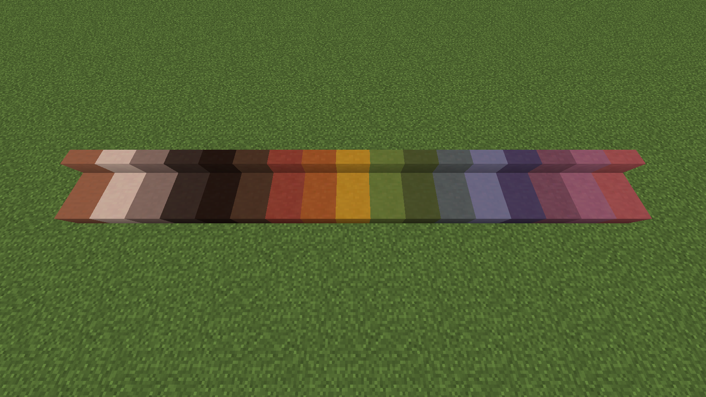
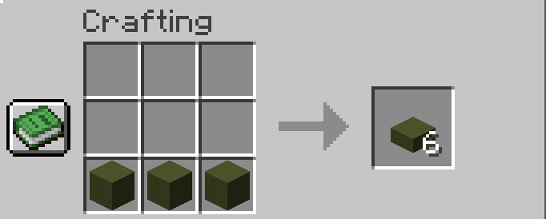
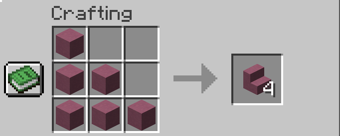

# Terracotta Blocks {#terracotta-blocks}

Terracotta blocks can be made by smelting a clay block and has multiple usage.

In this mod, many variants were added such as the slab and stairs.

[Back to Block List ↩️](./)

## Stats
<table>
    <tr>
        <th>Name</th>
        <td><i>COLOR</i> Terracotta <i>TYPE</i></td>
    </tr>
    <tr>
        <th>Rarity Tier</th>
        <td>Common</td>
    </tr>
    <tr>
        <th>Renewable</th>
        <td>Yes</td>
    </tr>
    <tr>
        <th>Stackable</th>
        <td>Yes (64)</td>
    </tr>
    <tr>
        <th>Tool</th>
        <td></td>
    </tr>
    <tr>
        <th>Hardness</th>
        <td>4.2</td>
    </tr>
    <tr>
        <th>Blast Resistance</th>
        <td>1.25</td>
    </tr>
    <tr>
        <th>Luminous</th>
        <td>No</td>
    </tr>
    <tr>
        <th>Transparent</th>
        <td>No</td>
    </tr>
    <tr>
        <th>Flammable</th>
        <td>No</td>
    </tr>
    <tr>
        <th>Catches fire from lava</th>
        <td>No</td>
    </tr>
</table>
 

<b>Miscellaneous Stats</b>

<table>
    <tr>
        <th>Translation Key</th>
        <td><code>block.bns.<i>COLOR</i>_terracotta_<i>TYPE</i></code></td>
    </tr>
    <tr>
        <th>Components (a.k.a. NBTs)</th>
        <td><code>nil</code></td>
    </tr>
</table>

## Blocks

### Terracotta Slab {#blocks.terracotta-slab}
 

<b>Click to expand</b>

<ul style="margin:20px">
<li>Terracotta Slab</li>
<li>White Terracotta Slab</li>
<li>Light Gray Terracotta Slab</li>
<li>Gray Terracotta Slab</li>
<li>Black Terracotta Slab</li>
<li>Brown Terracotta Slab</li>
<li>Red Terracotta Slab</li>
<li>Orange Terracotta Slab</li>
<li>Yellow Terracotta Slab</li>
<li>Lime Terracotta Slab</li>
<li>Green Terracotta Slab</li>
<li>Cyan Terracotta Slab</li>
<li>Light Blue Terracotta Slab</li>
<li>Blue Terracotta Slab</li>
<li>Purple Terracotta Slab</li>
<li>Magenta Terracotta Slab</li>
<li>Pink Terracotta Slab</li>
</ul>

### Terracotta Stairs {#blocks.terracotta-stairs}
 

<b>Click to expand</b>

<ul style="margin:20px">
<li>Terracotta Stairs</li>
<li>White Terracotta Stairs</li>
<li>Light Gray Terracotta Stairs</li>
<li>Gray Terracotta Stairs</li>
<li>Black Terracotta Stairs</li>
<li>Brown Terracotta Stairs</li>
<li>Red Terracotta Stairs</li>
<li>Orange Terracotta Stairs</li>
<li>Yellow Terracotta Stairs</li>
<li>Lime Terracotta Stairs</li>
<li>Green Terracotta Stairs</li>
<li>Cyan Terracotta Stairs</li>
<li>Light Blue Terracotta Stairs</li>
<li>Blue Terracotta Stairs</li>
<li>Purple Terracotta Stairs</li>
<li>Magenta Terracotta Stairs</li>
<li>Pink Terracotta Stairs</li>
</ul>

## Recipe
They can also be dyed with a Terracotta Slab/Stairs and a Dye just like how you would dye Blue Bed with Magenta Dye that makes Magenta Bed.

### Terracotta Slab {#recipe.terracotta-slab}

### Terracotta Stairs {#recipe.terracotta-stairs}
