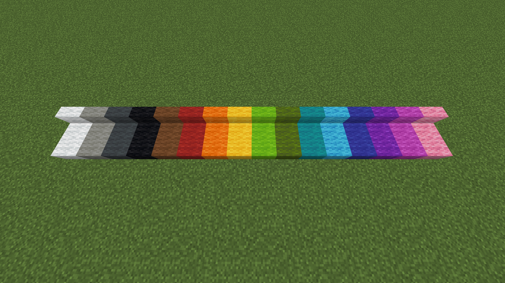
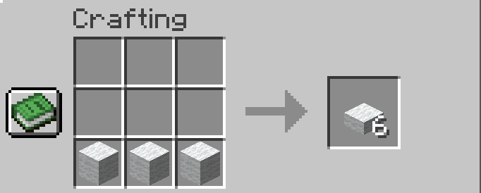
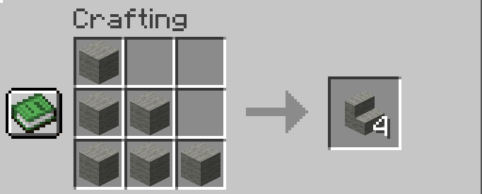

# Wool Blocks {#wool-blocks}

Wool blocks can be made by shearing a sheep or crafted with strings (only for white wool).

In this mod, many variants were added such as the slab and stairs.

[Back to Block List ↩️](./)

## Stats
<table>
    <tr>
        <th>Name</th>
        <td><i>COLOR</i> Wool <i>TYPE</i></td>
    </tr>
    <tr>
        <th>Rarity Tier</th>
        <td>Common</td>
    </tr>
    <tr>
        <th>Renewable</th>
        <td>Yes</td>
    </tr>
    <tr>
        <th>Stackable</th>
        <td>Yes (64)</td>
    </tr>
    <tr>
        <th>Tool</th>
        <td></td>
    </tr>
    <tr>
        <th>Hardness</th>
        <td>0.8</td>
    </tr>
    <tr>
        <th>Blast Resistance</th>
        <td>0.8</td>
    </tr>
    <tr>
        <th>Luminous</th>
        <td>No</td>
    </tr>
    <tr>
        <th>Transparent</th>
        <td>No</td>
    </tr>
    <tr>
        <th>Flammable</th>
        <td>Yes (30)</td>
    </tr>
    <tr>
        <th>Catches fire from lava</th>
        <td>Yes</td>
    </tr>
</table>
 

<b>Miscellaneous Stats</b>

<table>
    <tr>
        <th>Translation Key</th>
        <td><code>block.bns.<i>COLOR</i>_wool_<i>TYPE</i></code></td>
    </tr>
    <tr>
        <th>Components (a.k.a. NBTs)</th>
        <td><code>nil</code></td>
    </tr>
</table>

## Blocks

### Wool Slab {#blocks.wool-slab}
 

<b>Click to expand</b>

<ul style="margin:20px">
<li>White Wool Slab</li>
<li>Light Gray Wool Slab</li>
<li>Gray Wool Slab</li>
<li>Black Wool Slab</li>
<li>Brown Wool Slab</li>
<li>Red Wool Slab</li>
<li>Orange Wool Slab</li>
<li>Yellow Wool Slab</li>
<li>Lime Wool Slab</li>
<li>Green Wool Slab</li>
<li>Cyan Wool Slab</li>
<li>Light Blue Wool Slab</li>
<li>Blue Wool Slab</li>
<li>Purple Wool Slab</li>
<li>Magenta Wool Slab</li>
<li>Pink Wool Slab</li>
</ul>

### Wool Stairs {#blocks.wool-stairs}
 

<b>Click to expand</b>

<ul style="margin:20px">
<li>White Wool Stairs</li>
<li>Light Gray Wool Stairs</li>
<li>Gray Wool Stairs</li>
<li>Black Wool Stairs</li>
<li>Brown Wool Stairs</li>
<li>Red Wool Stairs</li>
<li>Orange Wool Stairs</li>
<li>Yellow Wool Stairs</li>
<li>Lime Wool Stairs</li>
<li>Green Wool Stairs</li>
<li>Cyan Wool Stairs</li>
<li>Light Blue Wool Stairs</li>
<li>Blue Wool Stairs</li>
<li>Purple Wool Stairs</li>
<li>Magenta Wool Stairs</li>
<li>Pink Wool Stairs</li>
</ul>

## Recipe
They can also be dyed with a Wool and a Dye just like how you would dye Red Bed with Brown Dye that makes Brown Bed.
### Wool Slab {#recipe.wool-slab}

### Wool Stairs {#recipe.wool-stairs}
