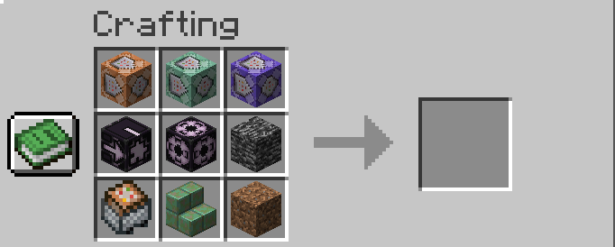

# Placeholder {#placeholder}

It's just a placeholder item.

It also has an invisible texture, so don't throw it on the ground.

[Back to Item List ↩️](./)

## Stats
<table>
    <tr>
        <th>Name</th>
        <td>Placeholder</td>
    </tr>
    <tr>
        <th>Rarity Tier</th>
        <td>Epic</td>
    </tr>
    <tr>
        <th>Renewable</th>
        <td>No</td>
    </tr>
    <tr>
        <th>Stackable</th>
        <td>No</td>
    </tr>
</table>
    

<b>Miscellaneous Stats</b>

<table>
    <tr>
        <th>Translation Key</th>
        <td><code>item.bns.placeholder</code></td>
    </tr>
    <tr>
        <th>Components (a.k.a. NBTs)</th>
        <td><code>nil</code></td>
    </tr>
</table>

## Recipe
It uses a lot of weird items.

- Dirt
- Bedrock
- Command Blocks, Minecart
- Jigsaw, Structure Block
- Waxed Weathered Cut Copper Stairs

